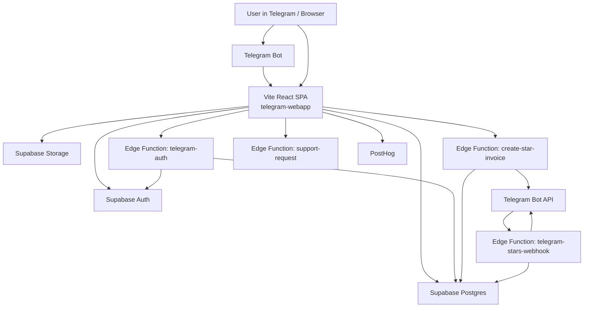

# Antigram Architecture Deep Dive

Last updated: 2026-07-05

This document describes the current Antigram Telegram Mini App architecture in enough detail for a future deep research task in ChatGPT, Claude, Codex, or another technical/product research agent.

It is intentionally broader than a README. It covers the product model, frontend architecture, backend/Supabase model, Telegram integration, monetization, data flows, important implementation decisions, known constraints, technical debt, and future research angles.

Note on naming: the current codebase and product documentation use `Antigram`. If external prompts mention `Fungram` or `Integram`, treat them as likely conversational aliases unless the product is formally renamed.

---

## 1. Product Summary

Antigram is a photo-sharing social network embedded primarily inside Telegram as a Telegram Mini App. Users capture or upload photos, apply analog film-style processing, attach a mood/emotion, publish moments, follow other users, browse feeds/search/collections, react to moments, organize albums, highlight selected profile photos, and support creators with Telegram Stars.

The product direction is not a generic Instagram clone. Its differentiation is:

- analog film aesthetics;
- mood-first discovery instead of only social graph/content categories;
- Telegram-native distribution;
- lightweight creator support through Stars;
- playful camera/film-loading ritual;
- profile identity expressed through film strips, albums, moods, and reactions.

The most direct competitive references for future research are:

- BeReal: authenticity, daily ritual, camera-first social loop;
- Instagram: profiles, feed, stories/reels, creator monetization;
- Lapse/Dispo-style apps: delayed/film camera aesthetics;
- Telegram-native mini apps: viral entry through bot/chat/channel surfaces;
- Pinterest / moodboards: visual discovery by vibe;
- TikTok/Reels: high-retention vertical consumption patterns, although Antigram is photo-first.

---

## 2. Current Runtime Surfaces

### 2.1 Telegram Mini App

Primary runtime. The app opens inside Telegram WebView through the Antigram bot / Mini App button.

Important Telegram-specific concerns:

- `window.Telegram.WebApp.initData` is used for Telegram auth.
- Safe area is handled through `safeAreaInset`.
- Telegram BackButton and HapticFeedback are used in selected flows.
- Bot onboarding now responds to `/start`, `/help`, `/language` and has inline web-app buttons.
- Telegram Stars payments require server-side Bot API interaction.

### 2.2 Standalone Web App

The same Vite SPA can run outside Telegram in a browser. In this mode:

- Telegram `initData` is absent;
- normal Supabase email/password auth is used;
- Telegram-specific features may be unavailable or degraded;
- useful for local development and fallback access.

### 2.3 Native Mobile Repo

There is a separate `../mobile` repository using React Native / Expo. It shares the Supabase backend/schema but not frontend code. Treat it as a reference implementation, not as an importable dependency.

Telegram Stars should not be blindly ported to native iOS/Android as a payment rail without revisiting platform rules.

---

## 3. High-Level System Architecture

Core principle: there is no self-hosted application backend. Client-facing business logic is either in React or in Supabase Edge Functions. Persistent state lives in Supabase Postgres and Storage.

---

## 4. Frontend Stack

Current frontend:

- React 18.3
- Vite 5
- TypeScript 5.6
- React Router v6
- Tailwind CSS 3.4 plus inline styles and CSS variables
- Supabase JS 2.45
- Telegram SDK packages are installed, but much Telegram interaction still uses `window.Telegram.WebApp`
- PostHog analytics
- JetBrains Mono font

Verification:

- `npm run build` is the main check.
- There is currently no separate test suite and no separate lint script.
- TypeScript is strict enough that unused imports/locals can break builds.

---

## 5. Route Tree

Routes are defined in `src/App.tsx`.

| Route | Component | Purpose |
|---|---|---|
| `/` | `FeedPage` | Home/personalized feed |
| `/explore` | `ExplorePage` | Explore/global feed surface |
| `/search` | `SearchPage` | Search users + discovery grid |
| `/notifications` | `NotificationsPage` | Activity notifications |
| `/upload` | `UploadPage` | Camera, film processing, upload |
| `/moment/:id` | `MomentPage` | Single moment view |
| `/profile/:userId` | `ProfilePage` | Other user's profile |
| `/me` | `MyProfilePage` | Own profile |
| `/me/:kind` | `FollowListPage` | Followers/following lists |
| `/moment-feed` | `MomentFeedPage` | Fullscreen vertical photo feed |
| `/album/:albumId` | `AlbumDetailPage` | Album detail |
| `/auth` | `AuthPage` | Standalone email auth |
| `/privacy` | `PrivacyPage` | Privacy policy |
| `/terms` | `TermsPage` | Terms |
| `/premium` | `PremiumPage` | Premium subscription screen |

Global shell behavior:

- `BottomNav` is hidden on `/upload`, `/moment-feed`, and `/album/*`.
- `MiniPlayer` is hidden on `/auth` and on routes where the bottom nav is hidden.
- The app is constrained to a mobile-first max width of 480px.

---

## 6. Core Product Flows

### 6.1 Entry and Auth Flow

Inside Telegram:

1. User opens bot / Mini App.
2. Telegram provides `window.Telegram.WebApp.initData`.
3. `AuthContext` detects Telegram context.
4. Client posts raw `initData` to Supabase Edge Function `telegram-auth`.
5. Edge Function verifies Telegram HMAC with bot token.
6. Edge Function upserts/fetches Supabase user/profile.
7. Edge Function returns Supabase session tokens.
8. Client calls `supabase.auth.setSession`.
9. Profile is loaded from `profiles`.
10. Telegram avatar is synced in the background if available.

Standalone web:

1. No Telegram `initData`.
2. User sees `AuthPage`.
3. Supabase email/password auth handles sign in/sign up.

Important risk areas:

- Do not weaken Telegram HMAC verification.
- Bot token must never be client-side.
- Telegram auth function must be deployed/configured correctly.
- Session establishment depends on Edge Function availability.

### 6.2 Film Loading and Camera Flow

Current intended camera ritual:

1. User taps center `[A]` button in `BottomNav`.
2. A film-picker bottom sheet opens.
3. User selects a film preset or `No filter`.
4. App navigates to `/upload` with `location.state.filmId`.
5. `UploadPage` locks the selected film for that camera session.
6. If user wants another film, they go back and load film again.
7. Camera screen shows a loaded-film indicator instead of a full film selector.
8. Capture uses camera video frame -> square crop -> pixel processing -> JPEG export.
9. Current export optimization: max side 1600px, JPEG quality 0.85.
10. Photo is uploaded to Supabase Storage bucket `moments`.
11. A `moments` row is inserted with `photo_url`, mood, film preset, visibility.
12. The user's selected mood is also added as an initial reaction.

Current film/camera UX direction:

- camera UI is being moved toward a dark tactile/neomorphic "physical camera" style;
- shutter button is styled as a brass concave physical button;
- film is treated as "loaded" before capture, not freely swapped inside the camera.

### 6.3 Feed Flow

Home feed (`FeedPage`):

- Default filter: `for_you`.
- If authenticated, calls `getFeed(user.id, 40)` to load moments from followed users.
- If personalized feed is empty, falls back to `getRandomMoments(40)`.
- If unauthenticated, uses `getRandomMoments(40)`.
- Emotion filters call `getMomentsByEmotion`.
- Loads reaction lists, user's own reactions, and Stars totals for visible moments.
- Supports optimistic reactions.
- Uses `CategoryFilmStrip` with following-scoped thumbnails when user is authenticated.

Explore/Search discovery (`SearchPage`):

- Search input finds profiles when query length >= 2.
- When not searching, shows discovery grid from random/global moments or emotion filter.
- Uses direct top reaction behavior: tapping visible top reaction increments/sets that reaction instead of opening full picker.
- Uses global category thumbnails.

Known issue / research area:

- `SearchPage` searches only profiles, not captions, moods, albums, or content.
- Emotion aggregation in `getMomentsByEmotion` is partly client-side and should be revisited for scale.

### 6.4 Profile Flow

Own profile (`MyProfilePage`):

- Shows film-strip highlights.
- Supports editing profile.
- Shows frames, followers, following.
- Supports follow list navigation.
- Shows albums.
- Supports support/admin sheets.
- Shows compact Premium entry.

Other profile (`ProfilePage`):

- Shows profile info, follow/unfollow, stats, moments.
- Shows top film strip if user has `highlights`.
- If no highlights but posts exist, falls back to latest public moments in the top film strip.
- Moments open into `MomentFeedPage`.

Important concept:

- `highlights` are pinned profile moments.
- The top film strip is a visual identity surface, not just a decorative carousel.

### 6.5 Moment Viewing and Reactions

Moment surfaces:

- `MomentCard` is used in feed/explore/profile grids.
- `MomentPage` handles single moment view.
- `MomentFeedPage` handles fullscreen vertical browsing.

Reaction model:

- `reactions` table stores unique `(user, moment)` reaction with `type`.
- Types: `warm`, `nostalgic`, `calm`, `wow`, `relatable`, `custom`.
- Moment mood is also used as an initial/custom emotional identity.
- UI shows top reaction counts and user's reaction state.

Recent UI fix:

- Fullscreen moment feed no longer shows duplicate reaction pills when the user's reaction matches the visible top reaction.

### 6.6 Notifications

Notifications are stored in `notifications`.

Client behavior:

- `NotificationsPage` loads notifications.
- `BottomNav` shows unread badge.
- Marking notifications read should dispatch `antigram:notifications-read` so the nav badge updates immediately.

Research areas:

- notification types and batching;
- push notifications through Telegram bot;
- reducing notification spam;
- social loops from reactions/follows/comments/stars.

### 6.7 Stars Support Flow

User flow:

1. User taps Stars support button.
2. Client calls `create-star-invoice` Edge Function.
3. Function validates Supabase auth token.
4. Function validates amount and moment.
5. Function inserts pending `star_payments`.
6. Function calls Telegram `createInvoiceLink`.
7. Telegram handles payment UI.
8. Telegram sends `pre_checkout_query` and `successful_payment` to `telegram-stars-webhook`.
9. Webhook verifies payment details and calls DB RPC `complete_star_payment`.
10. Totals are updated in `moment_star_totals` and `profile_star_totals`.
11. Author notification may be sent.

Important operational note:

- Telegram supports one webhook URL per bot.
- The webhook must point to `supabase/functions/telegram-stars-webhook`.
- For Telegram webhook delivery, deploy with `--no-verify-jwt`.
- `TELEGRAM_WEBHOOK_SECRET` should be used and configured as `secret_token` in Bot API.

Risk areas:

- idempotency of payment completion;
- webhook secret drift;
- repeated/replayed Telegram updates;
- exact production readiness of Premium subscription flow;
- manual recovery for pending/failed payments.

### 6.8 Bot Onboarding Flow

Current bot behavior:

- `/start` and `/help` send welcome text and inline keyboard.
- Buttons: open Antigram, what can I do, upload instructions, support, language toggle.
- Defaults to Russian when Telegram `language_code` starts with `ru`; otherwise English.
- `/language` shows language-switchable welcome.
- The bot also sets command/menu surfaces when messages are processed.

Recent operational fix:

- The bot was silent because Telegram webhook was not pointed at the Supabase function.
- The webhook was set via Bot API to `https://kwjjwmpcnukfxmwhjwed.supabase.co/functions/v1/telegram-stars-webhook`.

---

## 7. Data Model Overview

Main logical entities:

| Entity | Table / Source | Notes |
|---|---|---|
| User profile | `profiles` | Public identity, username, display name, avatar, admin/ban flags |
| Moment | `moments` | Photo post, mood, film preset, public/private fields |
| Reaction | `reactions` | Unique per user/moment |
| Follow | `follows` | Social graph |
| Comment | `comments` | Moment comments |
| Saved Moment | `saved_moments` | Bookmarks |
| Album | `albums` | User-owned collections |
| Album membership | `album_moments` | Many-to-many |
| Highlight | `highlights` | Pinned profile film-strip moments |
| Notification | `notifications` | Activity feed |
| Star payment | `star_payments` | Telegram Stars payment lifecycle |
| Moment star totals | `moment_star_totals` | Aggregated totals |
| Profile star totals | `profile_star_totals` | Aggregated totals |
| Premium subscription | `premium_subscriptions` | Premium status and Telegram payment metadata |
| Report | `reports` | Content reports |
| Support request | `support_requests` | User/admin support workflow |

The repo currently contains migrations for:

- Stars support and star totals;
- daily frame limit enforcement;
- support requests and support attachment storage;
- premium subscriptions;
- premium-aware daily frame limit.

Some older/ad-hoc migration files exist at repo root and should not be used for new migrations.

---

## 8. Supabase Architecture

### 8.1 Database Access

All app-level Supabase query helpers live in `src/lib/db.ts`.

Major helper domains:

- profiles and user search;
- feed, random moments, emotion moments;
- category thumbnails;
- moments and reactions;
- daily frame limit;
- Stars invoice creation and totals;
- premium subscription lookup;
- follows and follow lists;
- saved moments;
- comments;
- notifications;
- highlights;
- albums;
- deletion/reporting/admin ban functions.

This central data layer is useful for maintainability, but it can become large. Future architectural research should evaluate whether to keep a single file or split by domain while preserving clear query boundaries.

### 8.2 Storage

Known storage use:

- `moments` bucket for uploaded photo files.
- `support-attachments` bucket for support request attachments.

Current image optimization:

- new moment uploads are exported as JPEG;
- max side: 1600px;
- quality: 0.85.

Current quota signal:

- Supabase Free Plan warning was caused by Cached Egress, not DB or Storage size.
- This means the app is visually/storage light but image traffic can grow quickly.

Important future architecture direction:

- add dedicated thumbnails / responsive image URLs;
- use smaller assets in grid/profile/search/film strip surfaces;
- keep larger image only for detail/fullscreen;
- consider cache headers and Telegram WebView behavior;
- possibly reprocess existing stored images.

### 8.3 Edge Functions

| Function | Purpose |
|---|---|
| `telegram-auth` | Verify Telegram initData and mint Supabase session |
| `create-star-invoice` | Create Telegram Stars invoice link for a moment |
| `telegram-stars-webhook` | Handle bot onboarding, callbacks, Stars webhook events |
| `support-request` | Submit support requests with optional attachment |

Security principles:

- service role key only in Edge Functions;
- bot token only in Edge Functions;
- client uses anon key/session tokens;
- webhook functions receiving Telegram updates should not require Supabase JWT;
- user-authenticated functions should validate Bearer session.

---

## 9. UI / Design System Direction

Antigram's visual language:

- dark analog film;
- amber/brown/latte highlights;
- JetBrains Mono;
- film strips, sprockets, frames, grain;
- physical/tactile camera metaphors;
- central `[A]` brand mark.

Current UI patterns:

- bottom nav with central `[A]`;
- film picker bottom sheet before camera;
- camera screen with loaded-film concept;
- top film-strip profile header;
- category film strip for mood filters;
- rounded reaction pills;
- compact premium entry in profile;
- draggable mini music player.

Recent UI direction:

- camera is moving toward dark neomorphism / physical camera controls;
- shutter button is brass, tactile, and press-responsive;
- selected film is locked during camera session.

Future UI research angles:

- make the camera ritual more memorable without slowing posting;
- make mood/reaction system clear and emotionally expressive;
- avoid overloading profile with promos/controls;
- keep the analog look without sacrificing scanability;
- reduce visual clutter in fullscreen moment feed.

---

## 10. Monetization Architecture

Current monetization surfaces:

1. Telegram Stars support for creators/moments.
2. Premium subscription scaffolding.

Premium constants:

- `PREMIUM_ENABLED = false`;
- price: 149 Stars;
- period: 30 days;
- regular daily frame limit: 4;
- premium daily frame limit: 8;
- regular highlight limit: 5;
- premium highlight limit: 10.

Current state:

- Premium page and DB structures exist.
- Payment callback/polling flow needs verification before production reliance.
- Stars support flow is more concrete but still needs a serious audit for idempotency, webhook setup, and recovery states.

Research directions:

- creator status via Stars;
- visible support economy without turning the app into a pay-to-win feed;
- premium as aesthetic/tool upgrade rather than hard paywall;
- film packs, rare filters, expanded highlights, profile customization;
- avoid platform-policy conflicts outside Telegram.

---

## 11. Current Technical Debt and Risk Areas

### 11.1 Security / Privacy

- RLS policies need a dedicated audit, especially for moments, profiles, reactions, follows, notifications, reports, support, premium, and star payments.
- Storage policies for photo access need review.
- Bot webhook secret must stay correctly configured.
- Telegram auth HMAC verification must remain strict.
- No image moderation pipeline exists.
- Reports exist but there is no full admin review UI.

### 11.2 Performance / Scale

- Cached egress can exceed Free Plan quickly because photos are central.
- No dedicated thumbnails yet.
- Emotion feed aggregation may not scale.
- Feed queries and reaction loading can produce many client-side follow-up requests.
- Bundle size is above Vite's 500KB warning.
- No offline/service worker.

### 11.3 Product / UX

- Search only searches profiles, not moments/content.
- New-user onboarding depends heavily on bot/menu clarity.
- Feed empty states and discovery must stay strong for users with no follow graph.
- Camera UI must balance ritual and speed.
- Reactions/moods can confuse users if duplicated or over-explained.

### 11.4 Operations

- Deploying Edge Functions sometimes requires `--no-verify-jwt`.
- Telegram bot has one webhook; Stars and onboarding must share or be forwarded.
- Supabase quota monitoring matters, especially cached egress.
- Need repeatable setup guide for bot webhook, commands, Mini App URL, secrets.

---

## 12. Strategic Product Research Areas

This section is not the final research output. It lists areas a future deep research prompt should explore.

### 12.1 Camera-First Social Loop

Questions:

- Should Antigram have a daily photo ritual like BeReal?
- Should the app prompt users at a random time?
- Should a film be "developed" after delay or instantly?
- Can posting feel like loading a physical camera, shooting, waiting, and revealing?

Possible features:

- daily roll / limited frames;
- film development timer;
- streaks without making the app stressful;
- shared daily prompts by mood;
- "one take" mode for authenticity.

### 12.2 Mood-Based Discovery

Questions:

- Can moods become the main social graph, not just metadata?
- Should users follow moods, films, or visual styles?
- How can mood categories avoid feeling childish or shallow?

Possible features:

- mood channels;
- "people with your current vibe";
- mood maps;
- seasonal mood collections;
- AI-assisted but user-controlled mood tagging.

### 12.3 Profile as Identity

Questions:

- Is the top film strip enough as a signature?
- Should profiles have "rolls", "zines", "contact sheets"?
- How can Stars/support be visible without feeling transactional?

Possible features:

- profile contact sheet;
- pinned rolls;
- rare film badges;
- visual bio cards;
- creator support wall;
- collaborative albums.

### 12.4 Social Graph and Retention

Questions:

- Is follow graph enough for early retention?
- Should Antigram emphasize close friends, Telegram contacts, public discovery, or all three?
- How can Telegram channels/groups drive acquisition?

Possible features:

- invite cards;
- share moment to Telegram story/chat;
- friend activity;
- private rolls;
- group challenges;
- Telegram bot recaps.

### 12.5 Creator Economy

Questions:

- What should Stars mean socially?
- Should Stars boost ranking, unlock films, or stay as appreciation?
- How to avoid spam/farming?

Possible features:

- creator milestones;
- tasteful support counters;
- premium film unlocks;
- curated supporter rolls;
- anti-abuse limits and transparency.

---

## 13. Architectural Research Questions

A future deep research task should evaluate:

1. Should Antigram remain a pure Supabase client app, or introduce a domain backend/API layer?
2. How should thumbnails/responsive images be modeled in DB and Storage?
3. How should feeds be ranked: recency, follow graph, reactions, Stars, mood affinity, freshness?
4. Should emotion aggregation move to SQL views/RPC/materialized ranking tables?
5. How should recommendations work without overengineering early?
6. What is the right moderation architecture for photo social apps?
7. What RLS/security policies must be tightened before wider launch?
8. How should bot onboarding and Telegram notifications be formalized?
9. How should Premium be launched without breaking trust?
10. What analytics events are missing for product learning?
11. How to preserve analog aesthetics while improving accessibility/performance?
12. How to share code/logic with the native mobile repo, if at all?

---

## 14. Suggested Next Documents

This document is the architectural input. Recommended follow-up documents:

1. `ANTIGRAM_SECURITY_AND_READINESS_AUDIT.md`
   - RLS, storage policies, auth, webhook, payments, moderation, secrets.

2. `ANTIGRAM_PRODUCT_RESEARCH_PROMPT.md`
   - A prompt for ChatGPT deep research into features, competitors, trends, and positioning.

3. `ANTIGRAM_IMAGE_PIPELINE_PLAN.md`
   - Thumbnails, responsive assets, storage paths, migration/backfill plan.

4. `ANTIGRAM_FEED_AND_DISCOVERY_STRATEGY.md`
   - Ranking, mood discovery, cold start, collections, creator loops.

5. `ANTIGRAM_TELEGRAM_GROWTH_PLAN.md`
   - Bot onboarding, referrals, Telegram channels/groups, share cards, notifications.

---

## 15. Key Files for Future Researchers

Read these files first:

- `CLAUDE.md`
- `TG_MINIAPP_REFERENCE.md`
- `src/App.tsx`
- `src/contexts/AuthContext.tsx`
- `src/lib/db.ts`
- `src/lib/types.ts`
- `src/lib/premium.ts`
- `src/lib/support.ts`
- `src/components/BottomNav.tsx`
- `src/components/MomentCard.tsx`
- `src/components/CategoryFilmStrip.tsx`
- `src/components/StarSupportButton.tsx`
- `src/pages/FeedPage.tsx`
- `src/pages/SearchPage.tsx`
- `src/pages/UploadPage.tsx`
- `src/pages/MomentFeedPage.tsx`
- `src/pages/MyProfilePage.tsx`
- `src/pages/ProfilePage.tsx`
- `supabase/functions/telegram-auth/index.ts`
- `supabase/functions/create-star-invoice/index.ts`
- `supabase/functions/telegram-stars-webhook/index.ts`
- `supabase/functions/support-request/index.ts`
- `supabase/migrations/*.sql`

---

## 16. Short Executive Summary for Deep Research Prompt

Antigram is a Telegram-first analog photo social network built as a Vite React SPA on Supabase. It combines camera capture, film-style LUT processing, mood tagging, profile film strips, feeds, search/discovery, reactions, albums, notifications, Telegram Stars creator support, and a Premium scaffold. The architecture is intentionally lightweight: frontend React + Supabase Postgres/Auth/Storage + a small set of Edge Functions for Telegram auth, Stars, webhook/onboarding, and support.

The largest current opportunities are:

- image pipeline optimization with thumbnails/responsive assets;
- security/RLS/payment readiness audit;
- stronger Telegram-native onboarding/growth loops;
- clearer mood-based discovery;
- better feed ranking/cold start;
- product differentiation through camera ritual and analog identity;
- moderation/admin tooling;
- careful Stars/Premium monetization design.

The largest current risks are:

- cached image egress growth;
- RLS/storage/security uncertainty;
- Telegram webhook/secrets operational fragility;
- payment flow production-readiness gaps;
- no image moderation;
- search/discovery still shallow;
- feed/reaction aggregation scale limits.

